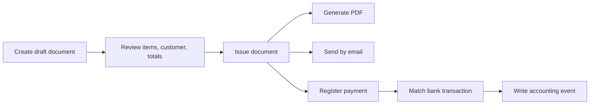
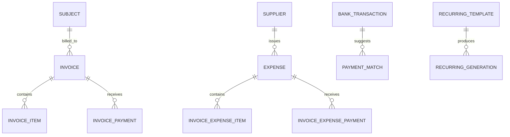

# CZ Accounting Module - Visual Overview

Reusable accounting module for Czech companies. Extracted from the Lakodi accounting domain and designed as an API-first package that can run backend-only in production or be embedded into a host application with an optional React UI.

This document is a product-facing capability overview. For extraction details and cutover strategy, see [CZ_ACCOUNTING_MODULE_EXTRACTION_PLAN](../md_roadmap/CZ_ACCOUNTING_MODULE_EXTRACTION_PLAN.md).

---

## 1. Snapshot

| Area | Current picture |
|------|-----------------|
| Scope | Czech accounting workflows for one company per deployment |
| Core model | API-first backend with optional UI library |
| Default production mode | Backend only |
| Demo UI in production | Disabled by default |
| Integration style | Mount router into FastAPI, consume REST API from custom or embedded UI |
| Primary strengths | Invoicing, expenses, bank matching, ARES, PDF generation, attachments, reminders, recurring workflows |

### Package map

| Package | Version | Role |
|---------|---------|------|
| `accounting-api` | `0.1.0` | Business logic and `create_accounting_router()` |
| `accounting-ui` | `0.1.0` | Optional React UI library with `AccountingApp` and i18n |
| `accounting-admin` | `0.1.0` | API-first reference host with optional demo UI |

### Deployment stance

```env
ACCOUNTING_SERVE_DEMO_UI=false
```

Production deployments are expected to expose the backend module and let each client choose its own frontend strategy.

---

## 2. System View

```mermaid
flowchart LR
    Host[Host FastAPI App] --> Router[accounting-api<br/>create_accounting_router()]
    UI[Optional accounting-ui<br/>React embedding] --> Host
    Demo[accounting-admin<br/>Reference host] --> Router

    Router --> DB[(SQLAlchemy database)]
    Router --> ARES[ARES lookup]
    Router --> PDF[PDF generation]
    Router --> Mail[Email delivery]
    Router --> Files[Attachment storage]
    Router --> Match[Bank matching engine]
```

### What this architecture means

- The backend is the product core.
- The host application owns auth, DB session wiring, and deployment.
- The UI library is optional, not mandatory.
- The reference admin app demonstrates the API-first integration model rather than defining the only supported UX.

---

## 3. What The Module Covers

| Domain | Included capabilities | Typical outcomes |
|--------|-----------------------|------------------|
| Documents and invoices | Create draft or issued documents, edit, list, detail, relations, PDF, email send, payment registration | Full outgoing billing lifecycle |
| Document conversions | Proforma to final invoice, quote conversion, correction flows, tax document from payment | Multi-step Czech invoicing workflows |
| Expenses | Expense records, detail, line items, payments, attachments | Incoming cost tracking |
| Subjects and customers | Customer registry, detail, create/update, ARES assist by name or ICO | Reusable company master data |
| Suppliers | Supplier registry, detail, create/update | Vendor management for expenses |
| Bank transactions | Transaction list, import, match generation, apply or reject match, ignore transaction | Faster reconciliation |
| Attachments | Upload, inbox, link to document or expense, archive, download | Accounting evidence traceability |
| Todos and reminders | Manual tasks, reminder preview, reminder send, reminder history | Follow-up and collections workflows |
| Recurring workflows | Recurring templates, pause, activate, cancel, generate runs, history | Repeated billing automation |
| Settings and defaults | Numbering, issuer defaults, payment defaults, document defaults | Consistent document output |
| Exports | Outgoing and expense exports in CSV and XLSX flows | Handover to external accounting or reporting tools |
| Audit and events | Document audit, global events, cross-entity accounting event history | Safer changes and reviewability |

---

## 4. Feature Map By Business Area

```mermaid
flowchart TD
    A[Documents] --> A1[Draft and issue]
    A --> A2[PDF and email]
    A --> A3[Payments and relations]
    A --> A4[Proforma quote correction flows]

    B[Expenses] --> B1[Expense records]
    B --> B2[Expense payments]
    B --> B3[Supplier-linked bookkeeping]

    C[Master Data] --> C1[Subjects customers]
    C --> C2[Suppliers]
    C --> C3[ARES lookup]

    D[Banking] --> D1[Transaction import]
    D --> D2[Candidate matching]
    D --> D3[Apply reject ignore]

    E[Operations] --> E1[Attachments inbox]
    E --> E2[Todos reminders]
    E --> E3[Recurring templates]
    E --> E4[Exports settings audit]
```



---

## 5. Core Workflow View



### Parallel operational workflows

| Workflow | What happens |
|----------|--------------|
| Expense capture | Upload attachment -> create expense -> link supplier -> record payment |
| Reconciliation | Import bank transaction -> generate candidates -> apply match -> link payment or expense |
| Follow-up | Create todo -> preview reminder -> send reminder -> keep reminder history |
| Automation | Define recurring template -> run generation -> inspect generation history |

---

## 6. Data Backbone

The module is not only an invoice form. It carries a broader accounting data model.

### Core entities

- `invoices`
- `invoice_items`
- `invoice_payments`
- `invoice_subjects`
- `invoice_suppliers`
- `invoice_expenses`
- `invoice_expense_items`
- `invoice_expense_payments`
- `invoice_bank_transactions`
- `invoice_payment_matches`
- `invoice_recurring_templates`
- `invoice_recurring_generations`
- `invoice_todos`
- `invoice_reminder_emails`
- `invoice_attachments`
- `invoice_accounting_events`
- `invoice_settings`
- `invoice_document_relations`
- `invoice_sequence_states`

### Relationship sketch



---

## 7. Integration Modes

| Mode | Best for | How it works |
|------|----------|--------------|
| Backend only | Production deployments with custom frontend | Mount `create_accounting_router()` into the host FastAPI app |
| Embedded UI | Teams that want a faster UI start | Use `@cz/accounting-ui` against the REST API |
| Reference host | Local demos, API verification, examples | Run `accounting-admin` with demo auth token |

The exact API prefix and route base are host-defined. A standalone host can expose `/api/invoices`, while Lakodi can preserve `/api/admin/invoices` during cutover.

### Backend integration

```python
from accounting_api import create_accounting_router

app.include_router(
    create_accounting_router(
        get_db=get_db,
        auth_dependency=require_accounting_access,
    ),
    prefix="/api/invoices",
)
```

### Frontend integration

```tsx
import { AccountingApp, AccountingConfigProvider } from "@cz/accounting-ui";

<AccountingConfigProvider
  config={{
    apiBaseUrl: "",
    apiPrefix: "/api/invoices",
    appBaseRoute: "/accounting",
    locale: "cs",
  }}
>
  <AccountingApp />
</AccountingConfigProvider>;
```

---

## 8. Why It Is More Than A Simple Invoice Module

| Simple invoicing tool | CZ Accounting Module |
|----------------------|----------------------|
| Outgoing invoices only | Outgoing documents plus expenses, suppliers, subjects, and bank workflows |
| Static customer form | Reusable subject registry with ARES assist |
| Manual payment notes | Structured payments and bank matching |
| PDF only | PDF, email, reminders, exports, recurring runs |
| Thin audit trail | Dedicated accounting events and document audit flows |
| UI-bound logic | API-first backend reusable across clients |

---

## 9. Operational Boundaries

This module is intentionally opinionated.

- Czech accounting workflows only.
- One company per deployment.
- No generic multi-tenant SaaS abstraction.
- Production runs backend-first.
- The bundled UI is optional and the reference UI is primarily for demo and integration validation.

---

## 10. Quick Positioning Summary

If you need a reusable Czech accounting backend that already understands invoicing, expenses, ARES, PDF output, bank reconciliation, reminders, recurring flows, and operational accounting evidence, this module is built for that exact shape of problem.
